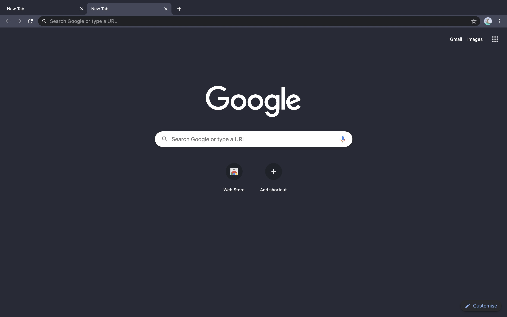

# Dracula for Google Chrome
> A dark theme for Google Chrome.

A darker version of the original Dracula theme for chrome by [Nick](https://github.com/nickimola).

## Install

All instructions can be found at [draculatheme.com/chrome](https://draculatheme.com/chrome).

## Team

This theme is maintained by the following person(s) and a bunch of [awesome contributors](https://github.com/orgs/dracula/people). This is a fork of the original [Dracula for Google Chrome](https://github.com/dracula/google-chrome).

 |
--- |
[Fabrizio](https://github.com/melefabrizio)|

## License

[MIT License](./LICENSE)
